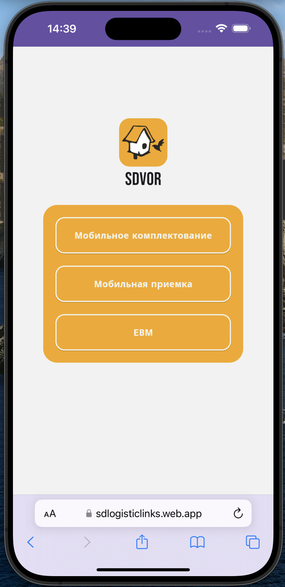
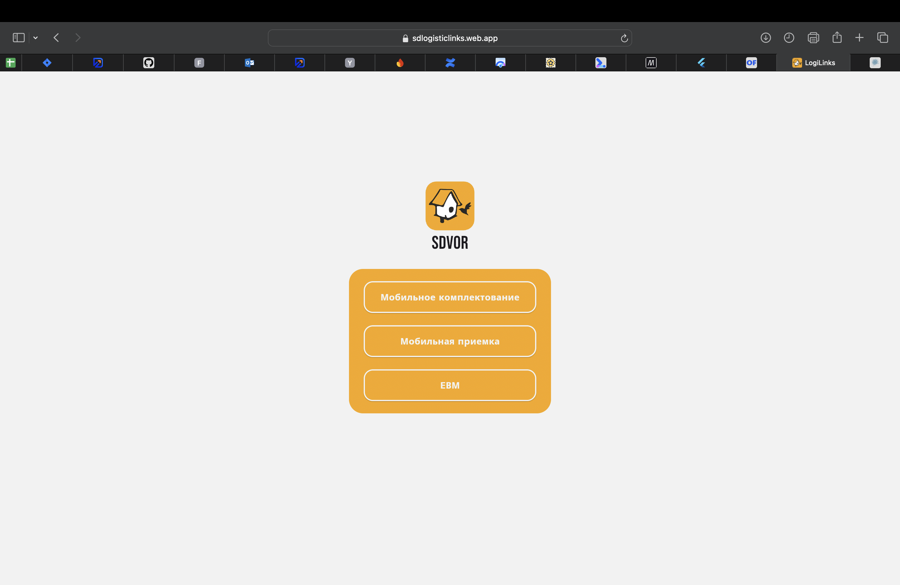

# LCP

**Logistic Common Place** — PWA-приложение, реализованное на **Flutter**, цель которого — объединить все нужные ссылки для работника склада в одном месте.  
Используется на специальных заводских терминалах на базе **Android**.

Ссылки ведут на инструменты в **SAP**, например:
- **EWM**
- **Мобильное комплектование**
- **Мобильная приёмка**

---

## Screenshots

  
  

